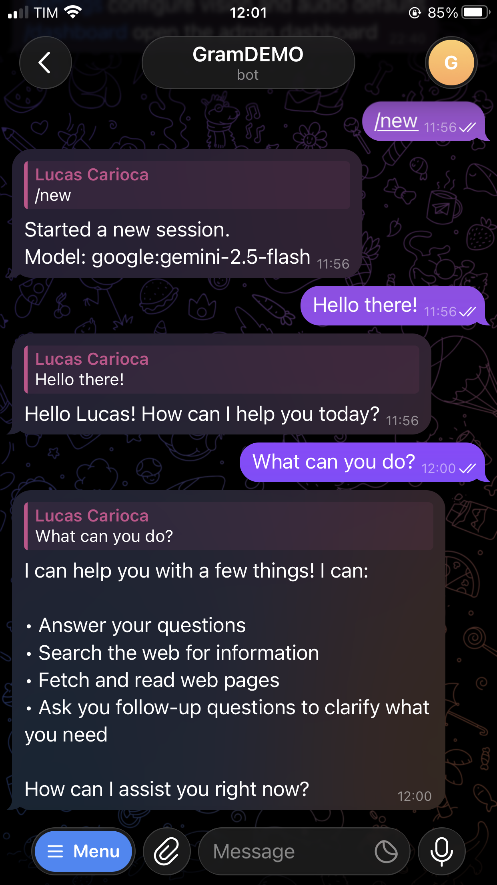
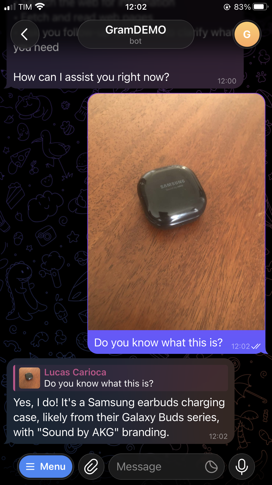
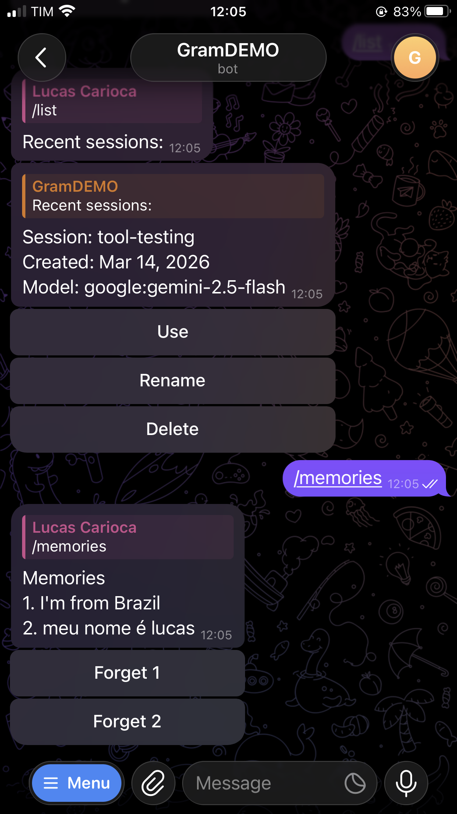
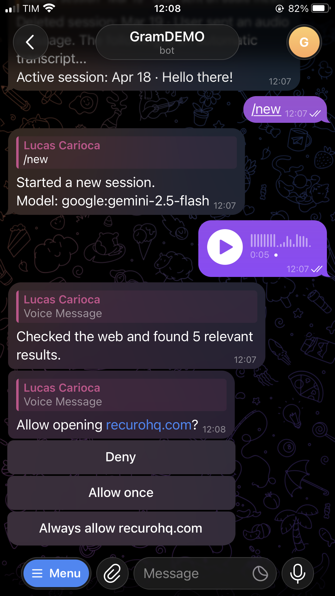
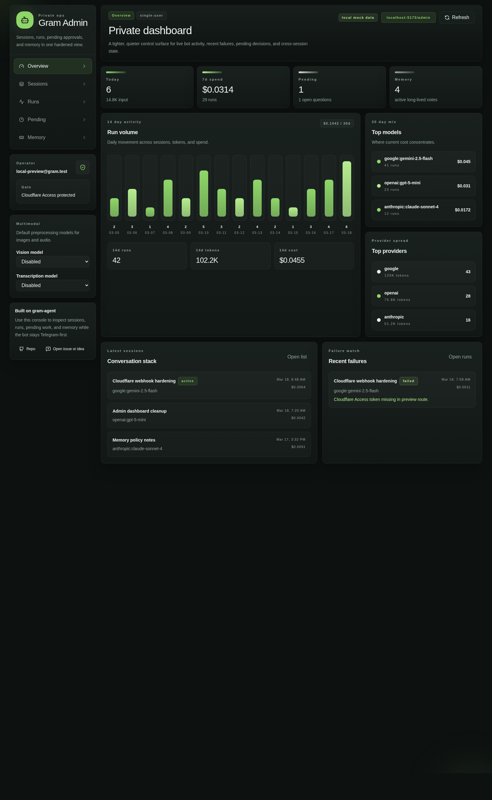
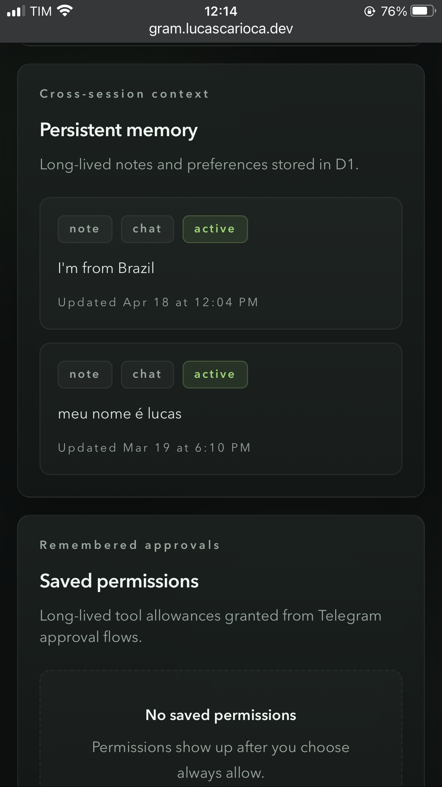

# gram-agent

[](https://deploy.workers.cloudflare.com/?url=https://github.com/lucasscarioca/gram-agent)

Telegram-first personal agent starter for Cloudflare Workers.

`gram-agent` is intentionally focused:

- private bot, not SaaS
- Telegram as the primary interface
- Cloudflare Workers + D1 as the default runtime
- built-in agent patterns without trying to be a full framework

## Highlights

- Telegram webhook bot built with Hono
- D1-backed sessions, messages, runs, pending work, and persistent memories
- built-in model support for Google, OpenAI, Anthropic, and OpenRouter
- Telegram-native controls with slash commands and inline keyboards
- token-aware context management with warnings and durable session compaction
- persistent memory with `/remember`, `/memories`, and `/forget`
- multimodal preprocessing for images, audio, files, and PDFs
- optional private admin dashboard at `/admin`
- Cloudflare Access-ready admin protection and custom-domain WAF guidance for the Telegram webhook

## Quick Look

<p align="center">
  
</p>

Browse sessions, respond in Telegram, and keep the bot as the primary interface.

| Multimodal image | Memory flow |
| --- | --- |
|  |  |
| Send an image and have it interpreted before it reaches the model. | Save long-lived notes with `/remember`, then review them with `/memories`. |

| Pending approval | Admin overview |
| --- | --- |
|  |  |
| Keep tool approvals and follow-up questions visible inside Telegram. | Inspect sessions, runs, pending work, and memory in the private dashboard. |

<p align="center">
  
</p>

Review long-lived notes and saved permissions in the private dashboard.

## Commands

- `/help`
- `/new`
- `/list`
- `/model`
- `/rename`
- `/delete`
- `/cancel`
- `/status`
- `/analytics`
- `/compact`
- `/remember`
- `/memories`
- `/forget`
- `/settings`
- `/dashboard` when admin is fully configured

## Dashboard

The admin dashboard is optional and feature-flagged.

- SPA served from the same Worker
- overview, sessions, runs, pending work, memories, and saved tool permissions
- designed for Cloudflare Access on `/admin/*`
- recommended on a custom domain, not `workers.dev`

## Security model

Base protections:

- secret webhook path
- Telegram `X-Telegram-Bot-Api-Secret-Token` verification
- allowlist by Telegram user ID
- optional allowlist by Telegram chat ID

Recommended hardened deployment:

- `/webhooks/telegram/*` public to Telegram, protected with WAF on a custom domain
- `/admin/*` private to you, protected with Cloudflare Access

Do not put Cloudflare Access on the Telegram webhook path.

## Quick start

```bash
pnpm install
pnpm run db:setup:local
pnpm run dev
```

Before deploying, you will still need to:

- create a Telegram bot
- set Worker secrets
- create and bind D1
- register the Telegram webhook

## Docs

- setup and deployment: [`README.md`](README.md)
- admin dashboard: [`docs/admin-dashboard.md`](docs/admin-dashboard.md)
- security hardening, Access, and WAF: [`docs/security-hardening.md`](docs/security-hardening.md)
- release history: [`CHANGELOG.md`](CHANGELOG.md)

## Notes

- `workers.dev` is fine for quick bot-only setups
- use a custom domain for the recommended webhook WAF + dashboard Access setup
- raw Telegram media is not stored; only derived text and metadata are persisted for multimodal preprocessing
